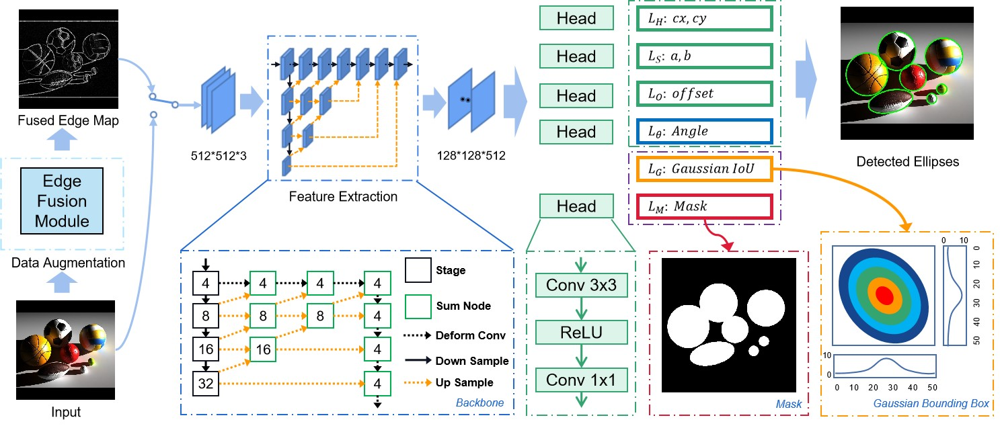
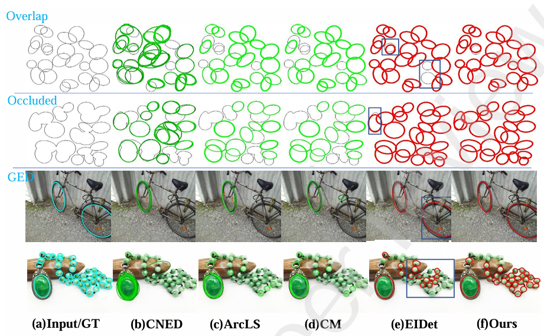
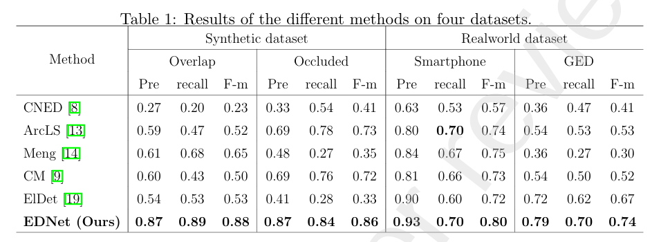

# Model-aware Ellipse Detection via Parametric Correlation Learning

This repository contains the official implementation of **Model-aware ellipse detection via parametric correlation learning**.

The method detects ellipse instances by learning parametric correlations among ellipse geometry representations. It is designed for ellipse detection tasks where the output is represented by the center point, major/minor axes, and rotation angle.

<div align="center">
  
</div>

## 1. Environment Configuration

- Python >= 3.6
- PyTorch >= 1.7.0
- Other dependencies are listed in `requirements.txt`

Install the basic Python dependencies:

```bash
pip install -r requirements.txt
```

Build DCNv2:

```bash
cd DCNv2
sh make.sh
```

Then copy the generated `DCNv2/build` folder to `dcn` if your local import path requires it.

## 2. Data Format

### 2.1 Annotation Format

The dataset uses COCO-style annotations. Ellipse annotations are stored in the `bbox` field:

```text
bbox = [cx, cy, a, b, theta]
```

where `cx, cy` are the ellipse center coordinates, `a, b` are the major and minor axes, and `theta` is the rotation angle in degrees.

### 2.2 Folder Structure

```text
data/
  your_dataset/
    images/
      1.jpg
      2.jpg
    annotations/
      train.json
      test.json
```

## 3. Usage

Train:

```bash
python train.py --data data/your_dataset --val_data data/your_dataset --device cuda:0
```

Run inference:

```bash
python predict.py \
  --weights results/train/best.pth \
  --annotations data/your_dataset/annotations/test.json \
  --image_dir data/your_dataset/images \
  --output_dir results/predict \
  --det_dir results/det
```

Evaluate:

```bash
python evaluation.py \
  --weights results/train/best.pth \
  --annotations data/your_dataset/annotations/test.json \
  --image_dir data/your_dataset/images
```

## 4. Detection Results

<div align="center">
  
</div>

<div align="center">
  
</div>

## 5. Citation

If this repository is useful for your research, please cite:

```bibtex
@article{jia2026model,
  title={Model-aware ellipse detection via parametric correlation learning},
  author={Jia, Qi and Liu, Zezheng and Liu, Yu and Wang, Yi and Xue, Xinwei and Wang, Weimin},
  journal={Signal Processing},
  volume={238},
  pages={110142},
  year={2026},
  publisher={Elsevier}
}
```
